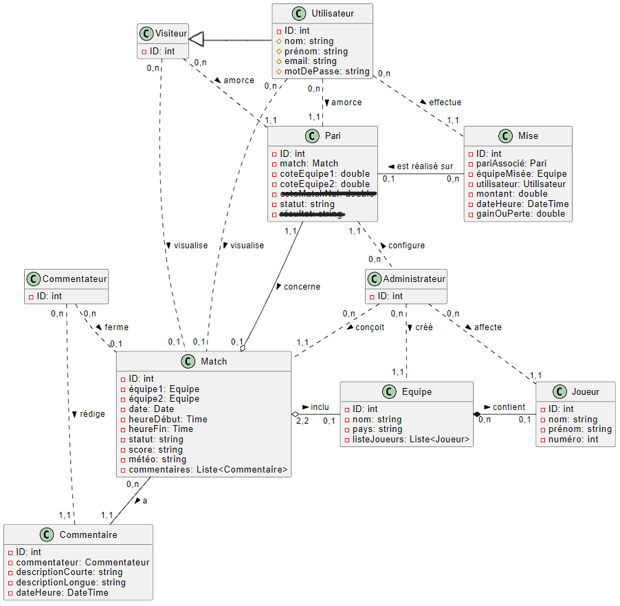
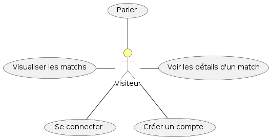
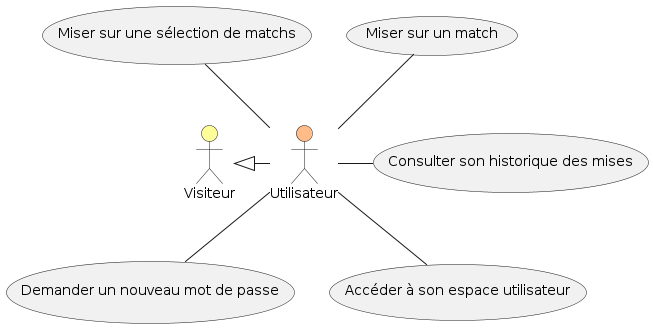
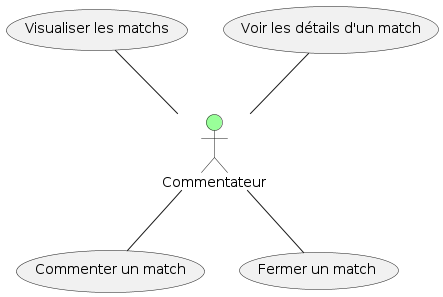
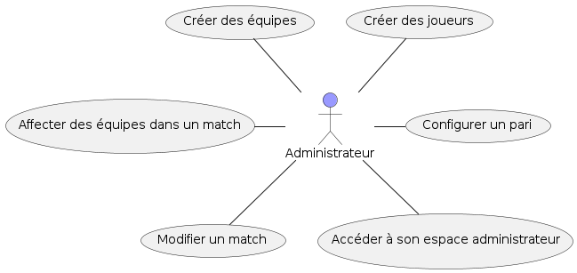
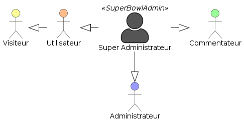
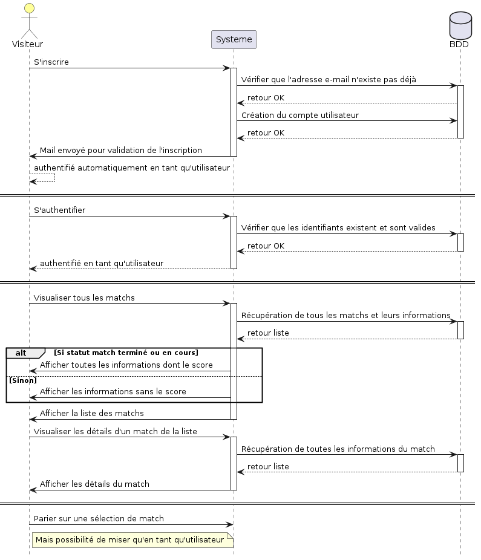
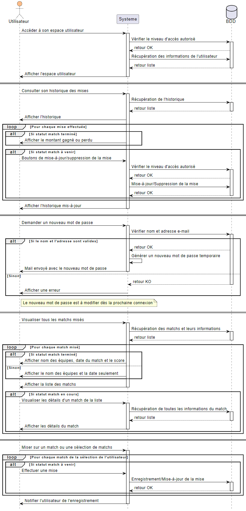
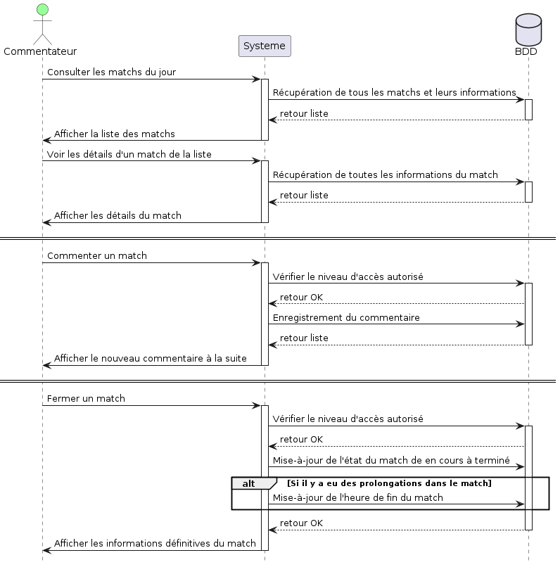
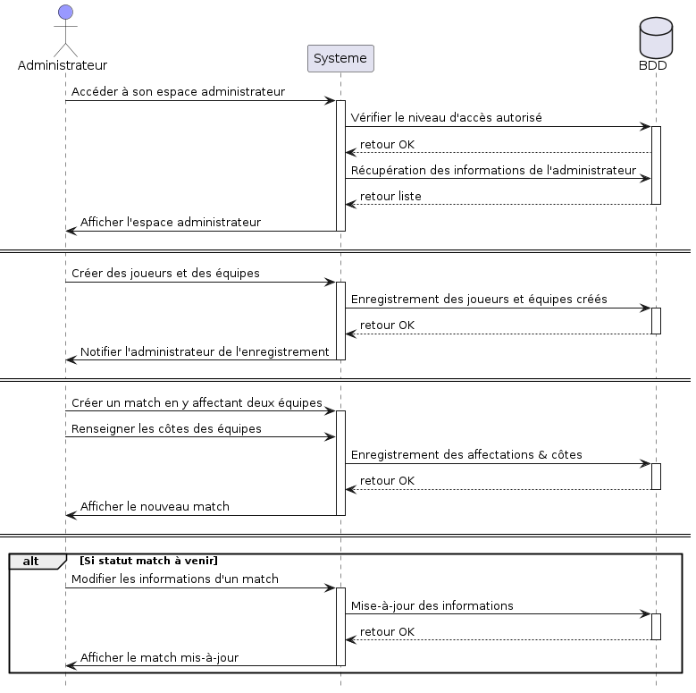

#Documentation technique de l'application

##Sommaire

1 [Réflexions initiales technologiques sur le sujet](#technologies-choice)

2 [Configuration de l'environnement de travail](#work-environment)

3 [Modèle conceptuel de données (MCD)](#mcd-diagram)

4 [Diagramme d’utilisation et diagramme de séquence](#diagrams)

5 [Explication du plan de test](#test-plan)

---


##Réflexions initiales technologiques sur le sujet {#technologies-choice}


TODO

(reprendre en partie ce qui est écrit dans la copie à rendre ?)


##Configuration de l'environnement de travail {#work-environment}


J'ai commencé la configuration de mon environnement de travail par générer une paire de clé SSH privée/publique, en prenant le soin d'y ajouter une phrase secrète, via la commande :
```
$ ssh-keygen -t rsa -b 4096 -C "kcoadalen@gmail.com"
```

J'ai alors copié/collé le contenu de ma clé publique dans les paramètres de mon compte GitHub.
Aussi j'ai ajouté ma clé privée à l'agent SSH après avoir lancé ce dernier grâce aux commandes :
```
$ eval "$(ssh-agent -s)"
$ ssh-add ~/.ssh/id_rsa
```

Par le biai de mon environnement de développement (VS Code), j'ai par ailleurs cloné mon nouveau dépôt distant en local ainsi que configuré mes informations Git pour l'historique de chaque commit via les commandes suivantes :
```
$ git clone git@github.com:kcdln/Smash-Bowl.git
$ git config user.email "kcoadalen@gmail.com"
$ git config user.name "Kenny Coadalen"
```

Puis j'ai vérifié le tout à l'aide des commandes suivantes :
```
$ ssh-add -l
$ git remote -v
```

Ensuite j'ai configuré VS Code en y intégrant tout un lot d'extensions utiles, telles que (pour ne citer que les plus installés) :
- [Bootstrap 4, Font awesome 4, Font Awesome 5 Free & Pro snippets](https://marketplace.visualstudio.com/items?itemName=thekalinga.bootstrap4-vscode)
- [Git Graph](https://marketplace.visualstudio.com/items?itemName=mhutchie.git-graph)
- [GitLens — Git supercharged](https://marketplace.visualstudio.com/items?itemName=eamodio.gitlens)
- [HTML CSS Support](https://marketplace.visualstudio.com/items?itemName=ecmel.vscode-html-css)
- [Live Server](https://marketplace.visualstudio.com/items?itemName=ritwickdey.LiveServer)
- [Markdown Preview Enhanced](https://marketplace.visualstudio.com/items?itemName=shd101wyy.markdown-preview-enhanced)
- [PHP Intelephense](https://marketplace.visualstudio.com/items?itemName=bmewburn.vscode-intelephense-client)
- [Prettier - Code formatter](https://marketplace.visualstudio.com/items?itemName=esbenp.prettier-vscode)


##Modèle conceptuel de données (MCD) {#mcd-diagram}


#### Diagramme MCD




#### Exemple du rendu en BDD


##Diagramme d’utilisation et diagramme de séquence {#diagrams}


#### Diagramme de cas d'utilisation












#### Diagramme de séquence










##Explication du plan de test {#test-plan}


TODO
